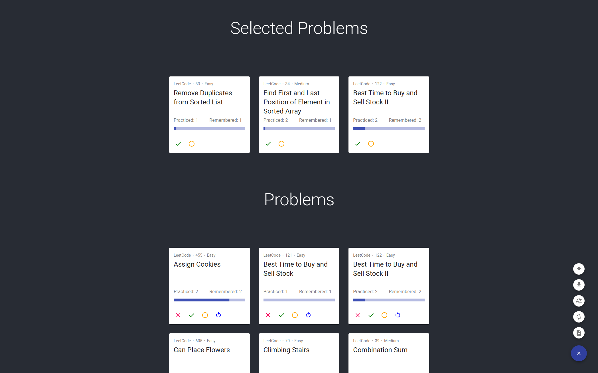

# EbbyCode

EbbyCode will select up to three problems from LeetCode and Codility based on the [Ebbinghaus' forgetting curve](https://en.wikipedia.org/wiki/Forgetting_curve).
The lower the receivability, the higher probability to be selected. 

## Screenshot

## Demo
Check out the project's [GitHub Page](https://mingyizhang.github.io/EbbyCode).
